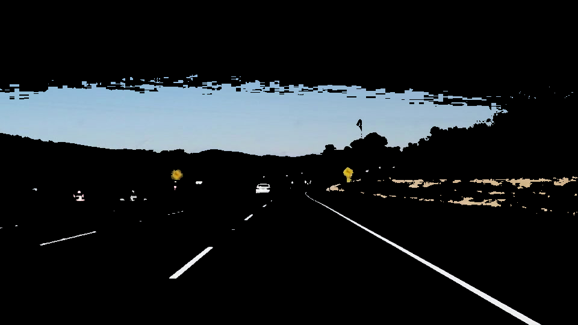
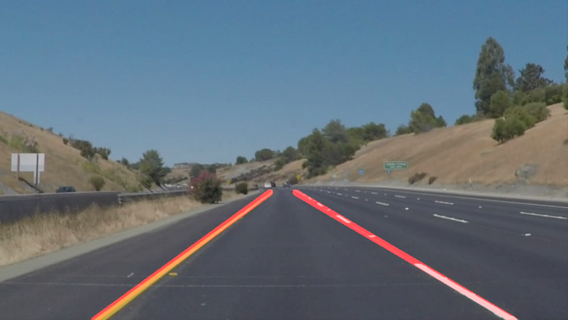

# **Finding Lane Lines on the Road** 

By: Jeremy Matson

**Finding Lane Lines on the Road**

The goals / steps of this project are the following:
* Make a pipeline that finds lane lines on the road
* Reflect on your work in a written report

---

### Reflection

### 1. Describe your pipeline. As part of the description, explain how you modified the draw_lines() function.

My pipeline consisted of 8 steps: 
1.	The images were converted to the HSL color space for lane line color masking. This helps with the optional challenge, in which shadows and differences in color intensity can cause error in line detection.

2.	The HSL masked images were converted to grayscale. This format is helpful for edge detection, as the gradient can be based upon pixel intensity.

3.	Each image was then blurred, utilizing a Gaussian blur filter. This helps reduce false edge detection by filtering out noise, and smoothing the image.

4.	Canny edge detection was performed to identify the edges in each image.

5.	The output from the edge detection was then masked to limit the region of interest to an area of the image in which lane lines should be expected. 

6.	This masked image of edges was then passed to a Hough transform function to return lines linearly defined points. 
7.	The lines returned from the Hough transform were then averaged and extrapolated into two individual lines that represented left and right lane lines. 
8.	Finally, these two lane lines were drawn onto the original image, semi-opaque, and the image was displayed.

 

In order to draw a single line on the left and right lanes, I modified the draw_lines() function as follows:
1.	I created arrays to store the x and y-coordinates of each line, and defined thresholds for line slope and ending y positions.
2.	The slope of each line was then calculated and evaluated to determine if it was within an expected range for lane lines defined in the direction of the vehicle's travel.
3.	Each line was then checked for validity (it must have contained at least two x and y-coordinates), to allow the function to continue returning an expected lane line. If this requirement was not met, the previous known lane line was returned instead.
4.	These coordinates were then passed to the NumPy polyfit and subsequent poly1d functions to generate an averaged line from a least squares fitment method.
5.	Color and thickness were then applied to the averaged and extrapolated lane lines. They were then returned to the pipeline for drawing on top of the image.

---

### 2. Identify potential shortcomings with your current pipeline

There are many potential shortcomings with a pipeline designed in this manner. 
1.	It does struggle to handle shadows and other impediments to lane line definition. Shadows specifically reduce the intensity gradient for proper edge detection of the lane lines. Impediments, such as traffic cones, may cause issues as well.
2.	It may not be able to handle sunlight shining directly toward the front of the vehicle, as this could reduce the intensity gradient and color definition of the lane lines. This particular issue can also cause old reflective lane lines (as a result of road construction) to become false positives.
3.	This algorithm may not be able to handle freeway off-ramps/exit lanes well, specifically where there may be a long break in a lane line for new-lane entry. This may also apply to merging lanes.
4.	This algorithm will not handle sharp road curvatures very well since the lane lines are defined linearly.
5.	Long-distance lane line detection on hills with steep incline may force an incorrect slope into the lane lines.
5.	It may struggle with lane changes because of the defined region of interest, and the restriction of two expected lane lines. There may be three lane-lines visible within the ROI during these times, and it may take some time for one to exit the masked area, while waiting for another to enter from the opposing side.
6.	It will not be able to find lane lines defined in a region perpendicular to the direction of vehicle travel, which may occur when a vehicle is turning at an intersection and must enter a new lane.

---

### 3. Suggest possible improvements to your pipeline

A possible improvement to the pipeline would be to fit a lane line more accurately with a multi-degree polynomial to account for curvature. It may require defining smaller line segments and aggregating them together, while averaging the points of overlap.

Another potential improvement could be to incorporate a moving definition of a polygon region of interest to follow steering angle and vehicle pitch relative to the horizon. This may allow for better long-distance lane line detection.

---

### Conclusion
This project allowed me to understand the basics of what is required to find lane lines on a road. There are many challenges in reliably detecting these lines in real world scenarios. Many of these challenges are related to environmental factors, as well as inconsistencies between roads. I look forward to improving these algorithms throughout these courses to improve lane detection reliability and robustness.
